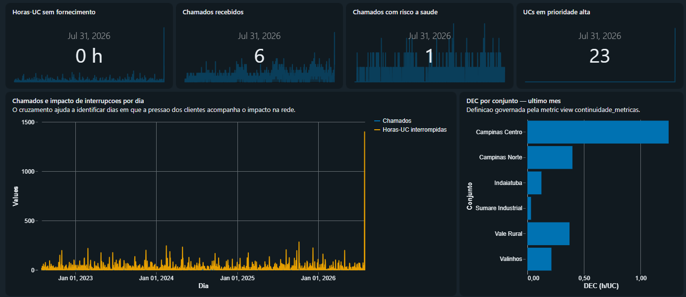
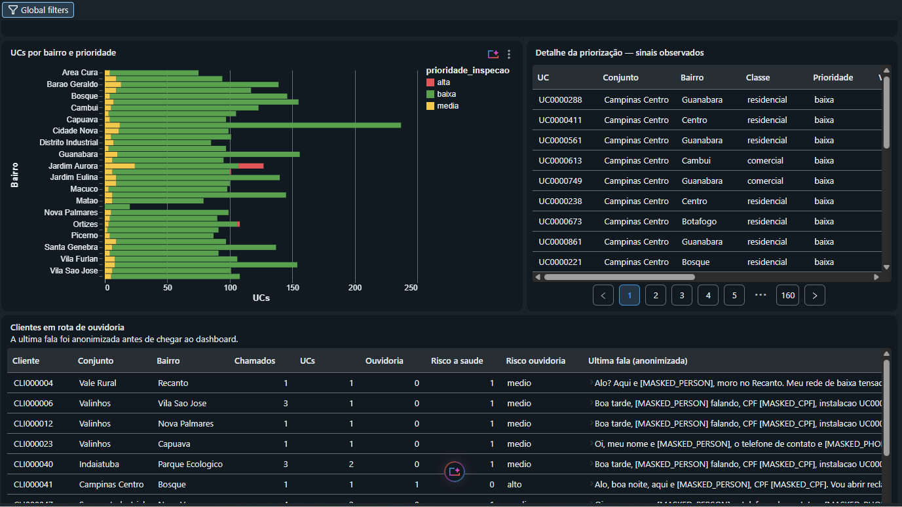

# Grid Intelligence

Plataforma analítica para operação de uma distribuidora de energia, construída sobre o Databricks.

O projeto transforma dados operacionais em uma experiência única de decisão: dados governados no lakehouse, indicadores de continuidade, priorização de inspeções, dashboard executivo e um copiloto conversacional para exploração assistida.

> Projeto demonstrativo da distribuidora fictícia **Luz do Vale**.

## Visão geral

O Grid Intelligence implementa um fluxo completo de dados, da ingestão de arquivos Parquet até o consumo por pessoas de negócio:

```text
Arquivos Parquet
      ↓
Raw / Volume Unity Catalog
      ↓
Bronze — cópia fiel e rastreável
      ↓
Silver — qualidade, tipagem e proteção de dados
      ↓
Gold — métricas e tabelas orientadas à decisão
      ↓
Dashboard Lakeview · Genie · Relatório executivo
```

### O que o projeto entrega

- Pipeline medalhão com camadas Bronze, Silver e Gold.
- Métricas de continuidade DEC/FEC centralizadas em uma Unity Catalog Metric View.
- Priorização de UCs para inspeção a partir de sinais observados nos dados.
- Tratamento de chamados sensíveis com mascaramento determinístico por regex.
- Dashboard operacional com visão de impacto, continuidade, prioridade e ouvidoria.
- Agente Genie para perguntas em linguagem natural sobre as tabelas Gold.
- Relatório executivo parametrizado por região e com modo determinístico ou opcionalmente assistido por `ai_gen`.
- Consultas de demonstração que evidenciam qualidade, governança e consistência entre camadas.

## Experiência do produto

### Dashboard operacional

O dashboard reúne os principais sinais da operação em uma visão executiva: horas-UC interrompidas, chamados recebidos, risco à saúde, UCs em prioridade alta, continuidade por conjunto e evolução diária.

<p align="center">
  
</p>

<p align="center">
  
</p>

### Copiloto conversacional

O agente permite consultar os dados operacionais sem abandonar as regras de governança definidas no lakehouse.

<p align="center">
  
</p>

## Arquitetura de dados

| Camada | Responsabilidade | Exemplos |
|---|---|---|
| Raw | Receber os arquivos de origem em volume gerenciado | unidades consumidoras, interrupções, consumo e chamados |
| Bronze | Preservar o dado de origem e registrar metadados de ingestão | cópia fiel, sem filtros ou correções |
| Silver | Aplicar tipagem, regras de qualidade e proteção | descartes auditáveis, anonimização por regex, interrupções válidas |
| Gold | Publicar entidades e métricas prontas para consumo | continuidade, saúde do cliente, prioridade e painel operacional |
| Consumo | Servir decisões e análises | Lakeview Dashboard, Genie e relatório executivo |

As transformações estão organizadas em [grid_intelligence/src/pipelines](grid_intelligence/src/pipelines), e os recursos Databricks são declarados em [grid_intelligence/resources](grid_intelligence/resources).

## Regras de negócio e governança

- Bronze não filtra nem corrige os dados de origem.
- Interrupções abaixo de três minutos não compõem DEC/FEC.
- DEC e FEC são definidos uma única vez na Metric View de continuidade.
- Dados pessoais são protegidos antes de chegarem às camadas analíticas.
- O mascaramento de identificadores usa regex; nenhuma função de IA é usada para mascarar dados.
- Prioridade de inspeção representa necessidade operacional observada e não constitui acusação.
- O agente e o relatório executivo consultam somente dados Gold.
- O relatório usa o último dia com movimento no painel, e não a data corrente do computador.

## Início rápido

### Pré-requisitos

- Databricks CLI 1.7.0 ou superior.
- [`uv`](https://docs.astral.sh/uv/) para o ambiente Python.
- Acesso ao workspace Databricks configurado no projeto.
- Perfil OAuth configurado na CLI.

O diretório executável do projeto é `grid_intelligence`:

```bash
cd grid_intelligence
```

O perfil real configurado na CLI é `grid_inteligence`, tratado neste projeto como o perfil lógico `grid_intelligence`. Por isso, os comandos abaixo usam explicitamente `--profile grid_inteligence`.

### 1. Preparar o ambiente

```bash
uv sync --dev
databricks auth profiles
```

### 2. Criar os catálogos

Os catálogos são criados fora do bundle, por SQL:

```bash
databricks experimental aitools tools query \
  --profile grid_inteligence \
  "CREATE CATALOG IF NOT EXISTS grid_dev COMMENT 'Catalogo de desenvolvimento da Grid Intelligence'"

databricks experimental aitools tools query \
  --profile grid_inteligence \
  "CREATE CATALOG IF NOT EXISTS grid_intelligence COMMENT 'Catalogo de producao da Grid Intelligence'"
```

### 3. Validar e publicar o bundle

```bash
databricks bundle validate --strict -t dev --profile grid_inteligence
databricks bundle deploy -t dev --profile grid_inteligence
```

O target `dev` utiliza o catálogo `grid_dev`. O bundle cria os schemas `raw`, `bronze`, `silver` e `gold`, além do volume `raw.landing`.

### 4. Carregar os dados de exemplo

Na raiz de `grid_intelligence`, envie a pasta `landing` para o volume criado:

```bash
databricks fs cp -r landing dbfs:/Volumes/grid_dev/raw/landing \
  --overwrite --profile grid_inteligence
```

O diretório contém quatro conjuntos de dados Parquet:

```text
landing/
├── chamados/chamados.parquet
├── consumo_diario/consumo_diario.parquet
├── interrupcoes/interrupcoes.parquet
└── unidades_consumidoras/unidades_consumidoras.parquet
```

### 5. Executar a solução

```bash
databricks bundle run sample_job -t dev --profile grid_inteligence
```

O job executa a ingestão, as transformações do pipeline, a Metric View, a governança e o relatório executivo.

Para testar o relatório com geração assistida opcional:

```bash
databricks bundle run sample_job -t dev --profile grid_inteligence \
  --params usar_ia=true,regiao=Campinas
```

O modo padrão é `usar_ia=false`, que produz um relatório determinístico a partir dos mesmos fatos Gold.

## Demonstração

As oito consultas de evidência estão em [grid_intelligence/src/sql/demonstracao.sql](grid_intelligence/src/sql/demonstracao.sql). Elas demonstram:

1. retenção entre Bronze e Silver;
2. qualidade e motivos de descarte do consumo;
3. equivalência entre Metric View e cálculo manual;
4. sinais de priorização de inspeção;
5. proteção de transcrições e identificadores;
6. identificação de um evento de pressão operacional;
7. tendência anual de consumo;
8. sazonalidade dos chamados.

A demonstração lê Bronze, Silver e Gold de forma intencional para provar o comportamento entre camadas. O relatório executivo, o dashboard e o agente são consumidores Gold-only.

## Recursos publicados

- [Dashboard operacional](https://dbc-7a6349ec-d685.cloud.databricks.com/sql/dashboardsv3/01f1b2d48635100d82b27c2f884cd507)
- [Genie — Copiloto de Operações](https://dbc-7a6349ec-d685.cloud.databricks.com/genie/rooms/01f1b2d69afb1f799da6428d57146efa)
- [Especificações funcionais](grid_intelligence/prompts/)
- [PRD e contexto do projeto](grid_intelligence/.llm/prd.md)

Os links de dashboard e Genie dependem de autenticação e permissões no workspace Databricks.

## Estrutura do repositório

```text
.
├── README.md
└── grid_intelligence/
    ├── databricks.yml              # configuração do bundle
    ├── resources/                  # pipelines, jobs, dashboard e schemas
    ├── src/
    │   ├── pipelines/              # transformações Bronze, Silver e Gold
    │   ├── notebooks/              # relatório executivo
    │   ├── dashboards/             # definição Lakeview versionada
    │   ├── genie/                  # definição serializada do Genie
    │   └── sql/                    # governança, métricas e demonstração
    ├── scripts/                    # aplicadores idempotentes
    ├── landing/                    # dados Parquet de demonstração
    ├── prompts/                    # especificações por etapa
    ├── tests/                      # testes automatizados
    ├── AGENTS.md                   # convenções para evolução do projeto
    └── pyproject.toml
```

## Qualidade e desenvolvimento

Execute as verificações locais antes de abrir uma alteração:

```bash
cd grid_intelligence
uv run pytest
uv run ruff check .
git diff --check
databricks bundle validate --strict -t dev --profile grid_inteligence
```

Para reiniciar o ambiente de desenvolvimento, o catálogo pode ser removido com `CASCADE`. Essa operação é destrutiva e deve ser executada somente após confirmar que o alvo é `grid_dev`.

## Licença e escopo

Este repositório é um projeto demonstrativo para arquitetura lakehouse, engenharia de dados, governança e experiências analíticas no Databricks. Os dados da Luz do Vale são fictícios e não representam uma distribuidora real.
